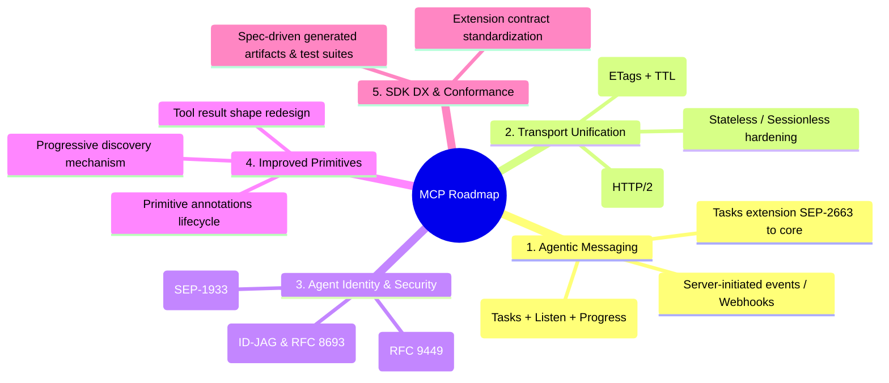

# MCP Roadmap Analysis & Impact on Warmplane

**Document Version:** 1.0  
**Date:** 2026-08-24  
**Status:** Strategy & Architecture Analysis  
**Reference:** [Model Context Protocol Roadmap (August 2026)](https://blog.modelcontextprotocol.io/posts/mcp-roadmap/) & [Official MCP Development Roadmap](https://modelcontextprotocol.io/development/roadmap)

---

## 1. Executive Summary

On August 22, 2026, the Model Context Protocol (MCP) Core Maintainers published an updated roadmap following the foundational **2026-07-28 specification release**. 

The MCP ecosystem is evolving rapidly from a simple request-response tool-calling protocol for interactive desktop clients into an enterprise-ready, transport-unified, asynchronous messaging and identity substrate for autonomous AI agent fleets.

### High-Level Impact on Warmplane

Warmplane was built as a local control plane and session facade to solve real-world problems in AI tool calling: context bloat ("the description tax"), execution non-determinism, missing idempotency, unmanaged secrets, and brittle client-server connectivity.

The new MCP roadmap directly validates Warmplane's core architecture while introducing new technical imperatives:
- **Strategic Validation:** MCP's new focus on **Progressive Discovery**, **ETag-based Caching**, and **Stateless/Sessionless HTTP** validates Warmplane's compact indexing, two-tier catalog architecture, and caching primitives.
- **Architectural Shift:** MCP's transition toward **HTTP-over-stdio (HTTP/2 multiplexing)**, **Server-Initiated Events (Webhooks/Channels)**, **First-Class Tasks (SEP-2663)**, and **DPoP/Workload Identity Federation** requires Warmplane to expand its transport and identity layers to maintain its position as the premier local/embedded control plane.

---

## 2. Key Takeaways from the MCP Roadmap

The 2026-08-22 MCP Roadmap organizes upcoming specification work into five strategic priority areas, backed by dedicated Working Groups (WGs) and Specification Enhancement Proposals (SEPs).



### Summary of Priority Areas

| # | Priority Area | Key Initiatives & SEPs | Core Maintainers / WGs |
|---|---|---|---|
| **1** | **Agentic Messaging Primitives** | • Server-initiated events (webhooks & push channels)<br>• Composition of Tasks, subscriptions/listen, and progress<br>• Maturing Tasks extension ([SEP-2663](https://modelcontextprotocol.io/seps/2663-tasks-extension)) into core spec | Caitie McCaffrey, Clare Liguori, Peter Alexander<br>*(Agents, Transports, Triggers & Events WGs)* |
| **2** | **HTTP-Native Transport Unification** | • Streamable HTTP over stdio via HTTP/2 multiplexing<br>• Standardized ETag caching for primitives & tool calls ([SEP-2549](https://modelcontextprotocol.io/seps/2549-TTL-for-list-results))<br>• Capability scoping post Stateless MCP ([SEP-2575](https://modelcontextprotocol.io/seps/2575-stateless-mcp), [SEP-2567](https://modelcontextprotocol.io/seps/2567-sessionless-mcp)) | Kurtis Van Gent, Nick Cooper<br>*(Transports WG)* |
| **3** | **Agent Identity & Enterprise Security** | • Finalize DPoP ([RFC 9449](https://www.rfc-editor.org/rfc/rfc9449)) adoption<br>• Workload Identity Federation ([SEP-1933](https://github.com/modelcontextprotocol/modelcontextprotocol/pull/1933))<br>• Enterprise-Managed Auth via ID-JAG & Token Exchange ([RFC 8693](https://www.rfc-editor.org/rfc/rfc8693)) | Paul Carleton, Den Delimarsky<br>*(Agent Identity WG, IETF OAuth/WIMSE)* |
| **4** | **Improved Primitives** | • Redesign `tools/call` result shape (resolve `content` vs `structuredContent` drift)<br>• Progressive discovery (hierarchical catalog entry points)<br>• Primitive annotations review/deprecation ([SEP-2200](https://github.com/modelcontextprotocol/modelcontextprotocol/pull/2200)) | Kurtis Van Gent, Peter Alexander, Den Delimarsky<br>*(Core Primitives WG, File Uploads WG)* |
| **5** | **Improved SDK & Developer Experience** | • Formalized extension contracts across roles<br>• Spec-driven codegen for Tier 1 SDKs and quickstarts<br>• Formal conformance test suites | Den Delimarsky, David Soria Parra<br>*(SDK WG)* |

---

## 3. Deep-Dive Analysis: What This Means for Warmplane

### D1. Progressive Discovery vs. Warmplane's Compact Facade
- **The Spec Direction:** Upstream MCP servers with hundreds of tools currently overwhelm LLM context windows (the "description tax"). MCP is introducing server-side progressive discovery so servers reveal tools dynamically as conversations narrow.
- **Impact on Warmplane:** Warmplane was ahead of the curve here with its hybrid BM25 + ONNX semantic search, two-tier `capabilities_list` + `capability_describe`, and profile filtering (saving 95%+ tokens).
- **Opportunity:** When official progressive discovery standards land, Warmplane can implement the standard client/server interfaces natively while retaining its competitive edge: cross-server aggregation, hybrid search across disparate upstreams, and client-agnostic token reduction.

### D2. Transport Unification: HTTP/2 over Stdio
- **The Spec Direction:** Maintaining dual transport pipelines (stdio JSON-RPC vs. remote Streamable HTTP) creates duplicated metadata and impedes feature parity. The roadmap targets unifying local subprocesses on Streamable HTTP over stdin/stdout using HTTP/2 framing.
- **Impact on Warmplane:** Currently, Warmplane implements both stdio framing and Streamable HTTP/SSE (via `rmcp`). Moving local upstreams and local client facades to HTTP-over-stdio will dramatically simplify Warmplane's internal transport abstraction layer, eliminate JSON-RPC transport impedance mismatches, and enable multiplexed concurrency over a single child process pipe.

### D3. Caching & ETag Standardization
- **The Spec Direction:** Extending SEP-2549 (`ttlMs`, `cacheScope`) with HTTP ETags to allow versioning and caching of tool call and resource results.
- **Impact on Warmplane:** Warmplane already implements SHA-256 ETag caching for catalog change feeds (`/v1/catalog/events`, `If-None-Match`). Standardizing ETags on primitive outputs and tool calls aligns directly with Warmplane's idempotency engine, replay store, and WORM-linked cache verifications.

### D4. Asynchronous Agent Messaging & Tasks (SEP-2663)
- **The Spec Direction:** Standard request/response fails for long-running workflows. Tasks (SEP-2663) and server-initiated push events (webhooks, channels) are moving into core specification.
- **Impact on Warmplane:** Warmplane's Human-In-The-Loop (HITL) suspension gates, batch execution engine, and sampling delegation already manage suspended/asynchronous execution states. Adopting SEP-2663 Tasks and webhook notifications will make Warmplane's approval gates and long-running upstream orchestrations 100% specification-compliant.

### D5. Non-Human Identity (NHI) & Enterprise Workload Identity
- **The Spec Direction:** Moving away from static API keys toward Workload Identity Federation, DPoP (RFC 9449), ID-JAG tokens, and RFC 8693 token exchange for sub-agent delegation.
- **Impact on Warmplane:** As autonomous agent swarms call Warmplane, Warmplane's audit logs, policy engine, and upstream credential injector (F4) must be capable of validating incoming DPoP proofs, propagating Workload Identity tokens, and enforcing fine-grained principal boundaries per sub-agent.

---

## 4. Strategic Assessment & Positioning

```
+-----------------------------------------------------------------------------------+
|                              AI Agent / Orchestrator                              |
+-----------------------------------------------------------------------------------+
                                         │ (DPoP / WIF / Progressive Discovery)
                                         ▼
+-----------------------------------------------------------------------------------+
|                               WARMPLANE CONTROL PLANE                             |
|  ┌─────────────────────────────────────────────────────────────────────────────┐  |
|  │  1. Ingress & Identity: DPoP Verification, WIF / ID-JAG Token Exchange      │  |
|  │  2. Discovery Facade: Progressive Tool Catalog, Hybrid Search, ETag Caching  │  |
|  │  3. Governance Engine: HITL Approvals, Policy Allowlists, Secret Redaction  │  |
|  │  4. Resilience & Safety: Idempotency Keys (idk_*), Circuit Breakers, WORM   │  |
|  │  5. Async Messaging: SEP-2663 Tasks, Webhooks, Multi-Roundtrip State        │  |
|  └─────────────────────────────────────────────────────────────────────────────┘  |
+-----------------------------------------------------------------------------------+
         │ (HTTP-over-stdio / H2)           │ (Streamable HTTP)         │ (Local CLI)
         ▼                                  ▼                           ▼
┌──────────────────┐               ┌──────────────────┐       ┌──────────────────┐
│ Upstream MCP #1  │               │ Upstream MCP #2  │       │ Upstream MCP #3  │
│ (e.g. Postgres)  │               │ (e.g. GitHub API)│       │ (e.g. Filesystem)│
└──────────────────┘               └──────────────────┘       └──────────────────┘
```

### Strategic Opportunities (O1–O4)

- **O1. Pioneer Spec-Compliant Progressive Discovery:** Warmplane is already the leading implementation of compact tool facades. Participating in the Core Primitives WG allows Warmplane to shape the standard around proven production patterns.
- **O2. High-Performance HTTP/2 Stdio Engine in Rust:** With Warmplane's native async Tokio stack, implementing HTTP/2 over stdio provides sub-millisecond local process multiplexing without OS socket overhead.
- **O3. Unified Tasks & HITL Bridge:** Standardizing Warmplane's suspension and human approval workflows on SEP-2663 Tasks allows any MCP-compliant client (Claude, Cursor, custom agents) to natively handle approval pauses without custom out-of-band protocols.
- **O4. Non-Human Identity (NHI) Gateway:** Acting as the local enterprise security boundary that translates incoming corporate workload tokens into scoped upstream credentials.

### Potential Risks & Challenges (R1–R3)

- **R1. Rust Ecosystem SDK Latency:** Official MCP SDK codegen experiments focus heavily on TypeScript/Python. The Rust MCP ecosystem (`rmcp` / custom crates) must keep pace with rapid SEP releases (SEP-2575, SEP-2567, SEP-2663).
- **R2. Upstream Ecosystem Fragmentation:** Upstream servers will adopt HTTP-over-stdio, Stateless MCP, and Tasks at different speeds. Warmplane must act as a compatibility bridge between legacy stdio/SSE servers and modern clients.
- **R3. Spec Churn on Tool Result Types:** Redesigning `tools/call` result schemas could break downstream client parsers if not carefully versioned.

---

## 5. Recommended Action Items for Warmplane

### Findings (F1–F4)

- **F1. Alignment with Stateless/Sessionless Direction:** Warmplane's internal design already minimizes stateful transport dependencies, positioning it well for the 2026-07-28 stateless shift.
- **F2. Immediate Demand for Idempotency + Tasks:** Combining idempotency (`idk_...`) with SEP-2663 Tasks creates an industry-first resilient execution guarantee for long-running agent tools.
- **F3. Transport Optimization via HTTP/2:** Subprocess stdio pipelines can gain substantial throughput and multiplexing gains by adopting Streamable HTTP framing.
- **F4. Identity Evolution:** Moving from environment-variable credentials to dynamic Workload Identity Federation is the primary requirement for enterprise cloud deployments.

### Concrete Action Plan (A1–A5)

- **A1. Align Discovery API with Core Primitives WG (Short-Term):**
  Track the Progressive Discovery specification in Core Primitives WG. Ensure Warmplane's `/v1/capabilities/search` and `capabilities_list` can seamlessly serialize into the emerging standard schema.

- **A2. Implement SEP-2663 Tasks Support (Short-Term):**
  Expose Warmplane's Human-In-The-Loop approval gates and batch runs as standard MCP Tasks with status polling and cancelation endpoints.

- **A3. Prototype HTTP/2 over stdio in Rust (Medium-Term):**
  Implement an experimental transport adapter in `src/mcp_server.rs` supporting HTTP/2 over process stdin/stdout, matching the Transports WG reference architecture.

- **A4. Adopt DPoP & Token Exchange in F4 Credential Engine (Medium-Term):**
  Integrate RFC 9449 (DPoP) verification and RFC 8693 token exchange mechanisms into Warmplane's credential custody and policy enforcement pipeline.

- **A5. Standardize Primitive Result Caching (Long-Term):**
  Extend Warmplane's existing catalog ETag infrastructure to tool execution results and resource reads in accordance with SEP-2549.
